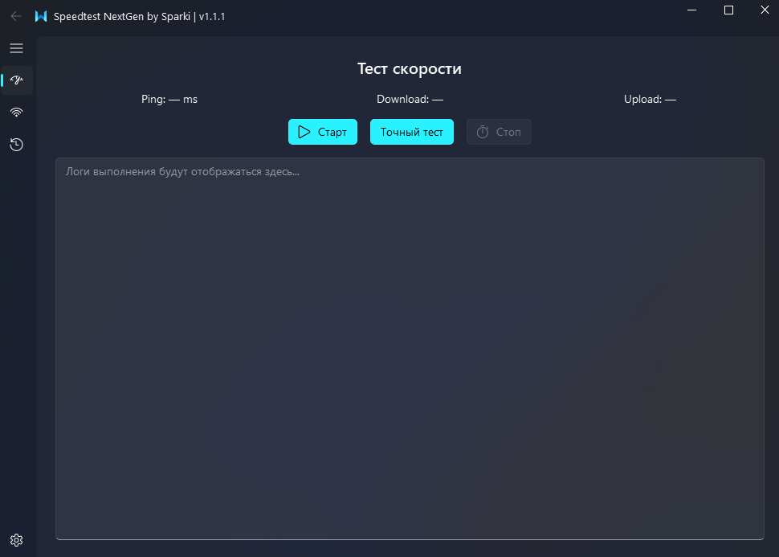
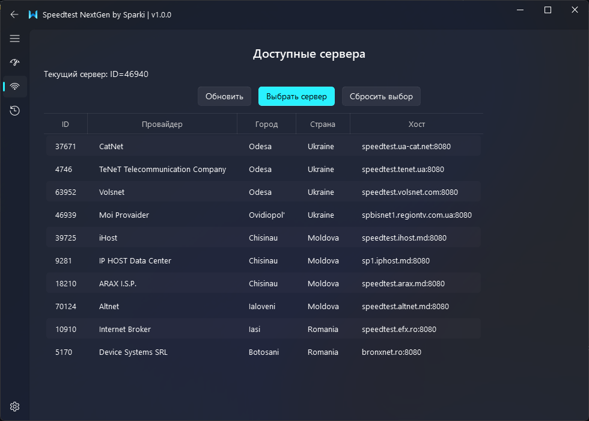
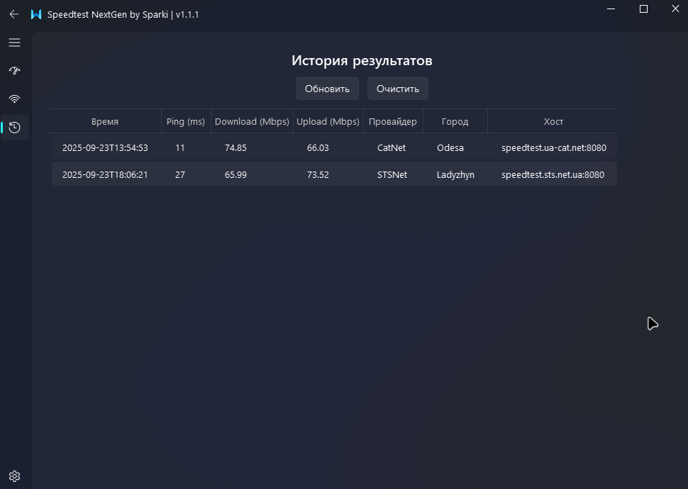
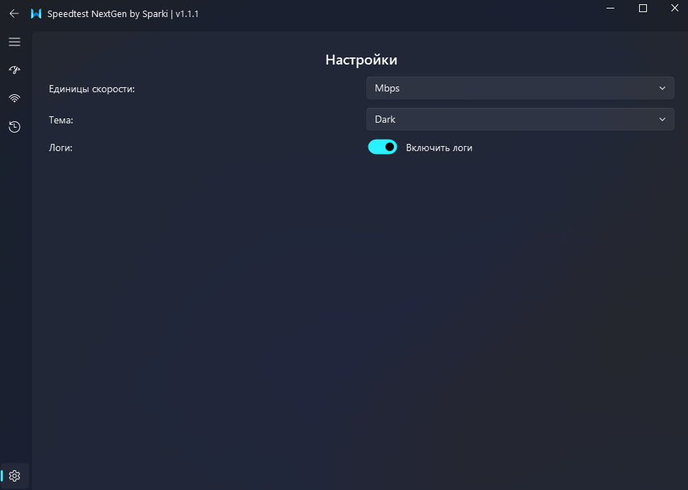

# Fluent Speedtest (Windows 10/11)

Красивый тестер скорости на PyQt5 + PyQt-Fluent-Widgets с тёмной темой, анимациями и сохранением результатов.

## Возможности
- Тёмная тема (по умолчанию), переключение темы в настройках
- Старт/Стоп теста скорости, анимированный индикатор (ProgressRing)
- Вывод значений Ping / Download / Upload
- Логи в UI и в консоль
- Сохранение результатов в `C:/Users/<Пользователь>/Documents/SpeedtestNextGen/data/results.jsonl`
- История: таблица, очистка

## Запуск
1. Установите зависимости:
   ```bash
   pip install -r requirements.txt
   ```
2. Запустите приложение (из каталога, содержащего папку `fluent_speedtest/`):
   ```bash
   python -m fluent_speedtest
   ```

   Альтернатива (если вы находитесь внутри папки `fluent_speedtest/`):
   ```bash
   python main.py
   ```

> Примечание: для работы требуется установленный пакет `qfluentwidgets`.

---

## Требования

- Windows 10/11 (поддерживаемая целевая платформа)
- Python 3.10+ (проект протестирован на 3.12/3.13)
- Зависимости из `requirements.txt`:
  - PyQt5
  - PyQt-Fluent-Widgets
  - PyQt5-Frameless-Window
  - speedtest-cli

## Скриншоты

### Главный экран


### Выбор сервера


### История тестов


### Настройки


## Быстрый старт

1) Клонируйте репозиторий и установите зависимости:

```bash
pip install -r fluent_speedtest/requirements.txt
```

2) Рекомендуемый запуск из корня проекта:

```bash
python -m fluent_speedtest
```

Альтернативы:
- Из корня проекта: `python fluent_speedtest\main.py`
- Из папки `fluent_speedtest/`: `python main.py`

Важно: запуск командой `python -m fluent_speedtest` гарантирует корректные импорты (во избежание `ImportError: attempted relative import with no known parent package`).

## Структура проекта

```
fluent_speedtest/
  core/
    settings.py         # настройки (Documents/SpeedtestNextGen/settings.json)
    speedtest_client.py # обёртка над speedtest-cli (выбор/поиск сервера, тест)
    worker.py           # фоновый исполнитель для GUI (QThread + сигналы)
    storage.py          # сохранение/загрузка результатов
  ui/
    test_interface.py       # экран запуска теста
    servers_interface.py    # выбор/обновление списка серверов
    history_interface.py    # история результатов
    settings_interface.py   # настройки (тема, единицы, логи)
  assets/
    app.ico             # иконка приложения (для сборки exe)
  app_window.py         # главное окно и навигация
  logging_utils.py      # логирование в консоль и в UI
  main.py               # точка входа при запуске скриптом
  __main__.py           # точка входа при запуске модулем: python -m fluent_speedtest
  README.md
  requirements.txt
```

> Примечание: Результаты тестов теперь сохраняются в Документах пользователя: `C:/Users/<Пользователь>/Documents/SpeedtestNextGen/data/results.jsonl`.

## Настройки

- Файл настроек: `C:/Users/<Пользователь>/Documents/SpeedtestNextGen/settings.json`
- Ключи:
  - `theme`: `Dark` или `Light`
  - `units`: `Mbps` или `MB/s`
  - `logs_enabled`: `true/false` — включение/скрытие панели логов и консольных логов
  - `server_id`: числовой ID выбранного сервера (опционально)

Настройки применяются «на лету» для логов и сохраняются автоматически при изменениях через UI.

## Использование

- Раздел «Тест скорости»:
  - Кнопка «Старт» — запускает тест в отдельном потоке (GUI не блокируется)
  - Кнопка «Стоп» — мгновенная отмена текущего теста (прерывает download/upload)
  - В конце теста в логах печатается резюме: Ping, Download, Upload, выбранный сервер, время

- Раздел «Серверы»:
  - «Обновить» — загрузить список ближайших серверов (до 300)
  - «Выбрать сервер» — сохраняет `server_id` в настройках
  - «Сбросить выбор» — автоподбор лучшего сервера

- Раздел «История»:
  - «Обновить» — перечитать `C:/Users/<Пользователь>/Documents/SpeedtestNextGen/data/results.jsonl`
  - «Очистить» — очищает историю

## Поведение выбора сервера и отмены

- Если `server_id` задан, приложение пытается использовать именно его.
- Если выбранный сервер недоступен (`NoMatchedServers`), приложение:
  - логирует предупреждение и
  - автоматически переходит к автоподбору лучшего сервера (без падений).

- Отмена теста:
  - Кнопка «Стоп» мгновенно поднимает флаг отмены и прерывает сетевые этапы
  - Тест завершается корректно с логом «Тест отменён пользователем»

## Формат результатов

Каждый тест сохраняется одной строкой в `C:/Users/<Пользователь>/Documents/SpeedtestNextGen/data/results.jsonl`:

```json
{
  "timestamp": "2025-09-21T19:06:28",
  "ping_ms": 11.0,
  "download_bps": 72800000.0,
  "upload_bps": 73600000.0,
  "server": {
    "id": 62489,
    "sponsor": "SKY-NET",
    "name": "Odesa",
    "country": "Ukraine",
    "host": "speedtest.sky-net.od.ua:8080"
  }
}
```

## Частые вопросы и проблемы

- «ImportError: attempted relative import with no known parent package»
  - Запускайте через `python -m fluent_speedtest` из корня проекта.

- «NoMatchedServers» при выборе сервера
  - Это штатно обрабатывается: выполняется автоподбор лучшего сервера. Можно вручную «Сбросить выбор» в разделе «Серверы».

- Предупреждение `QThread: Destroyed while thread is still running`
  - В проекте есть корректное завершение фонового потока. Если вы закрываете приложение во время активного теста, дождитесь завершения или нажмите «Стоп».

- Нет установленного `qfluentwidgets`
  - Установите пакет через pip: `pip install PyQt-Fluent-Widgets`

## Разработка

- Форматирование кода: стандартный Python style (PEP 8)
- Релизы: версия отображается в заголовке окна (см. `app_window.py`)
- Полезные точки входа:
  - `python -m fluent_speedtest` — запуск GUI
  - Модули GUI: в папке `ui/`
  - Логика: в папке `core/`

## Сборка (Nuitka)

Тестировалась сборка под Windows (MinGW) в режиме standalone. Пример однострочной команды:

```powershell
python -m nuitka --standalone --mingw64 --enable-plugin=pyqt5 --include-qt-plugins=platforms,styles,iconengines,imageformats,platformthemes,printsupport --include-package=qfluentwidgets --include-package-data=qfluentwidgets --include-package=qframelesswindow --windows-icon-from-ico=assets/app.ico --windows-company-name="By Sparki" --windows-product-name="SpeedTest Nextgen" --windows-file-description="SpeedTest" --windows-file-version=1.1.0 --windows-product-version=1.1.0 --windows-console-mode=disable --output-dir=build --output-filename=SpeedTestNextgen main.py
```

- Результат: `build\main.dist\SpeedTestNextgen.exe`
- Иконка exe берётся из `assets/app.ico`
- Данные сохраняются в: `C:/Users/<Пользователь>/Documents/SpeedtestNextGen/data/results.jsonl`

## Благодарности

- [speedtest-cli](https://github.com/sivel/speedtest-cli) — измерение скорости
- [QFluentWidgets](https://github.com/zhiyiYo/QFluentWidgets) — красивые Fluent-компоненты для PyQt

